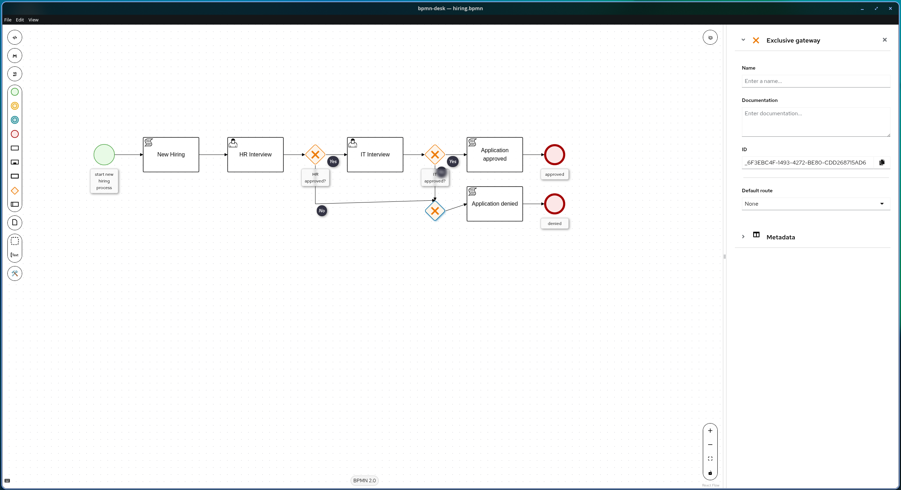

# bpmn-desk



A desktop application that lets you create, open, edit, and save
`.bpmn` diagram files natively on your desktop. Using Apache KIE BPMN editor https://github.com/apache/incubator-kie-tools

## Requirements

- [Node.js](https://nodejs.org/) 18+ (developed and tested with Node 26)
- Linux x64, macOS, or Windows (Electron 44)

## Getting started

```bash
git clone <this-repo> && cd bpmn-desk
npm install
npm start        # builds the renderer with Vite, then launches Electron
```

For development with live reload:

```bash
npm run dev      # Vite dev server on :5173 + Electron pointed at it
```

> **npm 11 note:** npm ≥ 11 blocks package install scripts by default. If
> `npm install` leaves the Electron binary missing (`Electron failed to install
> correctly`), run:
>
> ```bash
> npm install-scripts approve electron
> npm install-scripts approve esbuild
> npm rebuild electron esbuild
> ```
>
> Verify with `node -e "console.log(require('electron'))"` — it should print a
> path and `node_modules/electron/dist/electron` should exist.

## Scripts

| Script            | Description                                        |
| ----------------- | -------------------------------------------------- |
| `npm run build`   | Bundle the renderer (`renderer.mjs` → `dist/`)     |
| `npm start`       | Build, then launch the app                         |
| `npm run dev`     | Vite dev server + Electron with hot reload         |
| `npm run dist`    | Build + package installer for the current platform |
| `npm run dist:linux` | AppImage + `.deb` (Linux only)                  |
| `npm run dist:win`   | NSIS installer (must run on Windows)            |
| `npm run clean`      | Remove generated `dist/` and `release/`         |


## Trademarks

Apache KIE, BPMN, and Electron are trademarks of their respective owners. This
project is not endorsed by or affiliated with the Apache Software Foundation or
the Electron team.
